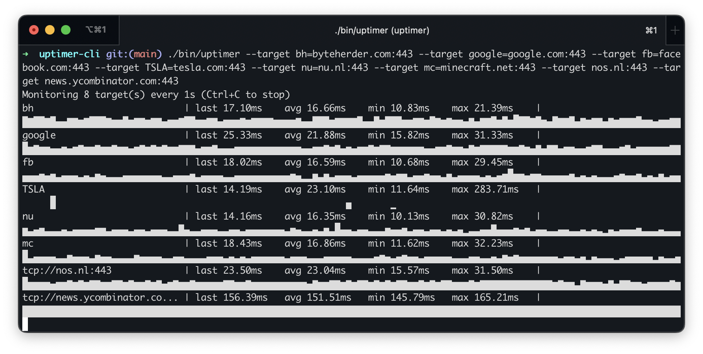

# uptimer-cli

[](https://github.com/therder/uptimer-cli/actions)
[](https://github.com/therder/uptimer-cli/releases)

`uptimer-cli` is a terminal-based latency monitor that continually probes TCP or UDP ports and renders a compact, real-time graph of response times. It is especially handy when you need to watch several services at once and want both numeric stats and a sense of trend at a glance.



## Features

- **Multi-target monitoring**: track several hosts/ports concurrently. Each target gets its own line with live stats and graph.
- **Flexible configuration**: supply targets via repeated `--target` flags (including `name=host:port` aliases) or point the CLI at a newline-delimited file.
- **Detailed metrics**: displays last, average, minimum, and maximum latency since the session started.
- **ASCII graphing**: uses Unicode block characters to show recent latency history relative to current max latency.
- **Cross-platform binary**: written in Go, builds to a single static binary (with Dockerfile provided for scratch-based container).

## Quick Start

```bash
go run ./cmd --target example=example.com:443 --target example.org:80
```

Or build once and reuse:

```bash
make build
./bin/uptimer --target byteherder.com:443
```

## Installation Options

### Go Install

```bash
go install github.com/therder/uptimer-cli/cmd@latest
```

### Docker

```bash
docker build -t uptimer-cli:latest .
docker run --rm uptimer-cli:latest --target byteherder.com:443
```

### From Source

```bash
git clone https://github.com/therder/uptimer-cli.git
cd uptimer-cli
make build
```

## Usage

```text
Usage:
  uptimer --target host:port [--target name=host:port ...] [flags]

Flags:
  --target value         host:port or name=host:port to probe (repeatable)
  --targets-file string  path to newline separated target definitions (same format as --target)
  --proto string         network protocol to use: tcp or udp (default "tcp")
  --interval duration    how often to measure latency (default 1s)
  --timeout duration     dial timeout per probe (default 3s)
  --name string          optional display name (applies when monitoring a single target)
```

Targets can be specified inline:

```bash
uptimer --target api=byteherder.com:443 --target worker=localhost:9000
```

Or via file:

```text
# targets.txt
api=byteherder.com:443
queue=localhost:5672
metrics=prometheus.internal:9090
```

```bash
uptimer --targets-file ./targets.txt
```

## Makefile Commands

- `make fmt` – run gofmt on all Go files.
- `make vet` – run `go vet ./...`.
- `make test` – run the unit test suite (`go test ./...` with temp cache).
- `make build` – build a host-platform binary at `bin/uptimer`.
- `make build-linux-amd64` – cross-compile a linux/amd64 binary (`bin/uptimer-linux-amd64`).
- `make run` – run the CLI directly via `go run`.
- `make lint` – fmt + vet + test.
- `make docker` – build the Docker image defined in the Dockerfile.
- `make clean` – remove build artifacts.

## Development

1. Ensure you have Go ≥ 1.22 installed.
2. Clone the repo and use the Makefile targets to format, test, and build.
3. Unit tests cover latency tracking, rendering helpers, parsing, and network stubs (`go test ./cmd/...`).

## License

MIT © 2025
